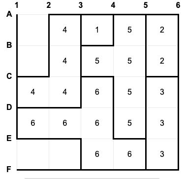
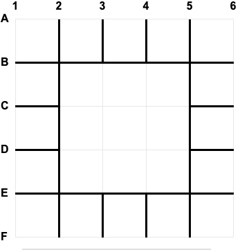
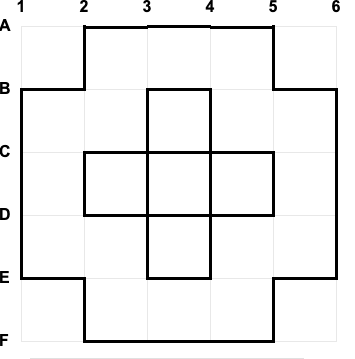

This is my entry winning CodeCup competition 2021 with the game zuniq.
for detailed ranking:

[Zuniq-ranking](https://www.codecup.nl/competition.php?comp=264#ranking)

## *What is Codecup?*
CodeCup is an online programming competition inviting programmers to write a piece of software able to play a specific board game between two players (or several players like [CodeCup 2017](https://archive.codecup.nl/2017/39/rules_less.html)).

Anybody can participate; there are no age restrictions or other special requirements. The CodeCup never charges entry fees.

test competitions are run regulary so you can improve your bot stratgey and fix errors in your program.
after that the final and the official competition is played. 

# *What is Zuniq game?*
You start on an empty grid of 6 x 6. You and your opponent place alternatively walls in the grid. You may close in zones, but these zones must all have a different size. It is forbidden to place walls in closed zones. The goal that you place the last wall and that you, consequently, win with 100 points against 50.

game "Zuniq" was created by Marcos Donnantuoni. It has very few elements and yet an unexpected complexity making it a good subject for AI programming enthousiasts.

for more information:

[Zuniq rules](https://www.codecup.nl/zuniq/rules.php)

## *AI description*

I used Monte Carlo Tree Search (MCTS) as the basic algorithm to find the best
move to play. Rapid Action Value Estimation (RAVE) was used to give the algorithm information about the promising branches to explore in the Tree[1].

I used a variant of RAVE that takes into consideration the opponent moves too and it does bring better results in practice, at least in Zuniq game. This can be justified by the fact that there is no black or white pieces but just placed walls because Zuniq is an impartial game.

[What is an impartial game?](https://en.wikipedia.org/wiki/Impartial_game)

a variant of MCTS-Solver[2] was used to improve endgame playing. the main change is to do a full search when moves count drops to a threshold(=5 in my program) and backpropagate the exact values to states to mark them as winning/losing states.

## *Position representation and conventions*
Position contains the following information:
- placed: represent the walls placed by the players
- possibleWalls: represent the walls which are empty and not in a closed state
- state: represent only the placed walls that are not inside a closed zone and this is what is used as a state value in MCTS
- possibleSizes: represent the possible sizes. at first it contains all value from 0 through 25. every time a zone is closed its size is removed from the list.

all the above are 64 bits unsigned integers so adding a wall is an `OR` with a flag and removing walls is an `AND` with `a complement`.

I refactored this into some methods that can find in "Common.h" header.

in addition to the following attributes:
- turns: represent how many turns were played in this position
- walls: an array representing possible walls
- wallsLength: represent the length of possible walls

There are 30 horizontal wall and 30 vertical one. I encoded them like:

- if wall index is in [0..29] then it is the horizontal wall number "index". starting from left to right, up to buttom.

- if wall index is in [30..59] then it is the vertical wall number (index-30). starting from left to right, up to buttom.

## *Enhancements*
The Tree was saved in a map and kept between game moves.
the map associates a state (unsigned integer of 32 bits) to a StateInfo struct which provides the following:
  - an array of ActionInfo that stores information about actions in this state
  - state status which can be WIN, LOSS or UNKNOWN for unresloved yet states
  - winning action which makes sense only if it is a winning state
- visits count of this state


an extension for AMAF by considering also the value of an action when it is played by the opponent too.
so for every action in a state there are 3 values:
  1. Q1 the Monte Carlo stats
  2. Q2 the AMAF stats
  3. Q3 the (lets say Generalised AMAF) stats by considering also when either me or my opponent played this action in the sub tree.

an exploration bonus was added for each action that depends on its impact on reducing the possible moves.
So finally the selection algorithm is trying to select action a that maximize this quantity:

value = (n1 * v1 + n2 * v2 + n3 * v3) / (n1 + n2 + n3) + impact * sqrt(visits) / n (1)

where
  Qi = (vi, ni), i = 1, 2, 3
  
  n = n1 + n2 + n3
  
  impact = count of possible moves before playing action ai - count of possible moves after playing action ai

I found that RAVE-MAX[3] is more stable so I used formula (1) but with

v2 = max(v2, v1)

v3 = max(v3, v1)

a generalised state representation was used. so whenever a position contains a closed zone all walls inside it are ignored in its representing state. The state does not care if black or white has to move. the states are expressed according to the player to move. this helped a lot to avoid many redundant computations when two positions differs just by a wall inside a closed zone.

findZone(wall) was the most expensive function so I tried to avoid it in random move generation. a random possible wall is choosen and if its zone is valid pick it otherwise pick randomly another possible wall..etc

For opening (turn < 21) I compiled a list of good walls for each player with some statistics of top bots games in the last competition results. during opening just those good moves are considered for me. this had the effect
of reducing the branching factor at by sqrt(2).

Those are the good opening moves for white:



and those are the good opening moves found for black:



for tricking opponents the selection phase is done with epsilon-greedy approach for opponent so 10% of the time opponent moves are chosen at random so my player is playing moves that propose more pitfalls for opponent.

for the endgame I used an MCTS-solver approach so whenever search reached terminal positions I propagate the exact values to mark parent states winning/losing accordingly.

I enhanced my endgame calculation by doing a full search for positions where the moves count drops to 5 instead of random simulations for better information for (6)

## *Time management*
I used for the turns less than 19, 2 seconds in addition of 0.25 seconds to check if the most visited action
correspond to the best and do more iterations untill they match.

Starting at move 19 I use half of the remaining time but no more than 2.75s. 0.25 checking is kept also at this
phase.

## *Opening moves*

They were generated by this program using the maximum iterations count for turn 1 through 5 winning 4 seconds for black and 6 seconds for white.
There are 8 symmetries in Zuniq board so for opening I pick a random symmetry to return my moves after applying
the symmetry and applying its inverse when reading opponent moves.

## *External libraries used*
I used hashmap implementaion based on robin hood algorithm which gives better performance in comparison with std::unordered_map. It is nice that it is provided as header only so it is easy to integrate in my submission for CodeCup competition.

for more information:
[robin-hood-hashing](https://github.com/martinus/robin-hood-hashing/blob/master/src/include/robin_hood.h)

## *Building the player*

get the [robin-hood-header](https://github.com/martinus/robin-hood-hashing/blob/master/src/include/robin_hood.h) and put it `in path/to/zuniq-ai/sources`

in a terminal:

```
cd path/to/zuniq-ai/sources
mkdir build
cd build
cmake ..
make
```

Of course you will need CMake building tool and a C++ compiler for that

## *Alphazero approach* try
The game was a good candidate for an alphazero
-- TODO add some alphazero introduction
-- TODO add description of what was done for that

## *Could be done*
-- TODO

## References
[1] Monte-Carlo Tree Search and Rapid Action Value Estimation in Computer Go by Sylvain Gelly and David Silver

[2] Monte-Carlo Tree Search Solver by Yngvi Björnsson and Mark H.M. Winands

[3] D.Tom, “Investigating UCT and RAVE: Steps towards a more robust method,” M.S. thesis, Univ. Alberta, Edmonton, 2010.

[4] D.Tom and M.Müller, “A Study of UCT and its Enhancements in an Artificial Game,” in Proc. Adv. Comput. Games, LNCS 6048, Pamplona, Spain, 2010, pp. 55–64.
